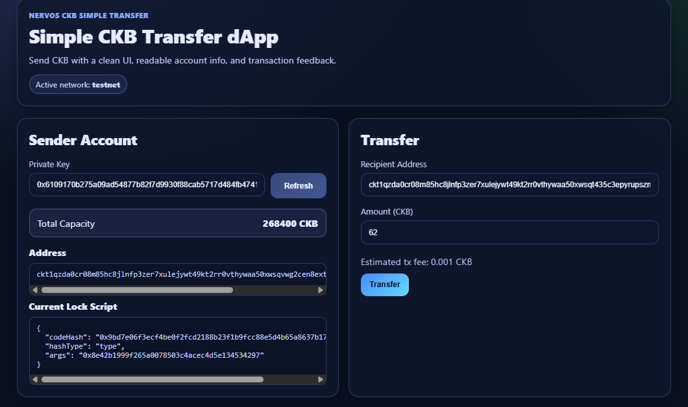
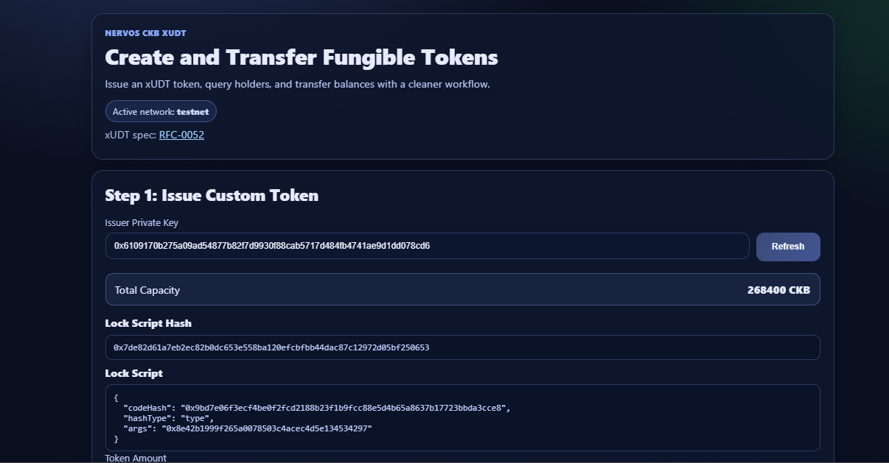

# Week 1 Learning Report - CKBuilders Journey

## Personal Summary

This week I focused on learning CKB by building real dApps from the official tutorials and making them run reliably on my local environment (Windows + OffCKB).

I completed and tested three projects:

1. `simple-transfer` - transfer CKB between accounts
2. `store-data-on-cell` - write and read message data from a Cell
3. `xudt` - create and transfer fungible tokens

I also completed the first two lessons on CKB Academy during this week.

---

## What I Learned This Week

- How the Cell model works in practical app flows.
- How CCC SDK builds, completes, signs, and broadcasts transactions.
- How xUDT token identity is derived from issuer lock-script hash args.
- Why local dev environments fail (port conflicts, DB locks, indexing delays) and how to fix them.
- How to improve learning demos with better UX and clearer network/environment controls.

---

## Work Completed by Project

## 1) `simple-transfer` (Transfer CKB)

### Implementation
- Set up the official tutorial app in `simple-transfer/`.
- Added network switching commands:
  - `start:devnet`
  - `start:testnet`
  - `start:mainnet`
- Added `check:devnet` to verify local RPC quickly.
- Improved `.gitignore` to avoid committing generated/local files.

### UX Improvements
- Redesigned UI with a cleaner card-based layout.
- Added active network visibility in the app.
- Improved input handling and transfer feedback state.

### Debugging Notes
- Fixed OffCKB conflicts caused by duplicate node instances (`EADDRINUSE` + DB lock).
- Confirmed stable startup and build after cleanup.

---

## 2) `store-data-on-cell` (Write/Read On-chain Data)

### Implementation
- Created project in `store-data-on-cell/` from official tutorial example.
- Added same environment workflow:
  - `start:devnet`
  - `start:testnet`
  - `start:mainnet`
  - `check:devnet`
- Added Next Step notes for switching environments.

### UX Improvements
- Applied polished UI style consistent with `simple-transfer`.
- Added network badge and clearer sectioning.
- Replaced popup-heavy flow with inline feedback.

### Debugging Notes
- Fixed "cell not found" issue by adding retry/polling before failing read.
- Added `Writing...` / `Reading...` loading states.
- Improved reliability of write -> read cycle.

---

## 3) `xudt` (Create Fungible Token)

### Implementation
- Created project in `xudt/` from the official create-token tutorial.
- Added environment scripts and devnet RPC checks:
  - `start:devnet`
  - `start:testnet`
  - `start:mainnet`
  - `check:devnet`
- Updated config/ignore safety similarly to other projects.

### UX Improvements
- Redesigned app for clearer 3-step learning flow:
  - Issue token
  - Query issued token cells
  - Transfer token
- Added cleaner result panels, error messages, and loading states.
- Added active network display to reduce confusion.

---

## CKB Academy Progress

- Completed Lesson 1
- Completed Lesson 2

These lessons helped reinforce the conceptual side while I was building the three tutorial dApps in parallel.

---

## Validation Performed

I ran these checks repeatedly while implementing and debugging:

- `npm install`
- `npm run check:devnet`
- `npm run lint`
- `npm run build`

All three projects are building successfully and are runnable.

---

## Screenshots (Week 1 Deliverables)

### Simple Transfer

### Store Data on Cell

### Create / Transfer Fungible Tokens (xUDT)

---

## Challenges Faced and How I Solved Them

1. **OffCKB startup conflicts**
   - Issue: duplicate node processes caused port and DB lock errors.
   - Fix: killed stale processes and enforced single running instance.

2. **Environment switching confusion**
   - Issue: shell differences caused friction while setting `NETWORK`.
   - Fix: introduced explicit npm scripts for devnet/testnet/mainnet.

3. **On-chain read timing**
   - Issue: read action sometimes happened before cell indexing/availability.
   - Fix: implemented retry/polling + better user feedback.

4. **Demo readiness**
   - Issue: tutorial UIs were functional but not presentation-ready.
   - Fix: implemented polished, consistent UI style across all three projects.

---

## References

- [Transfer CKB](https://docs.nervos.org/docs/dapp/transfer-ckb)
- [Store Data on Cell](https://docs.nervos.org/docs/dapp/store-data-on-cell)
- [Create a Fungible Token](https://docs.nervos.org/docs/dapp/create-token)
- [CKB Academy Courses](https://academy.ckb.dev/courses)
