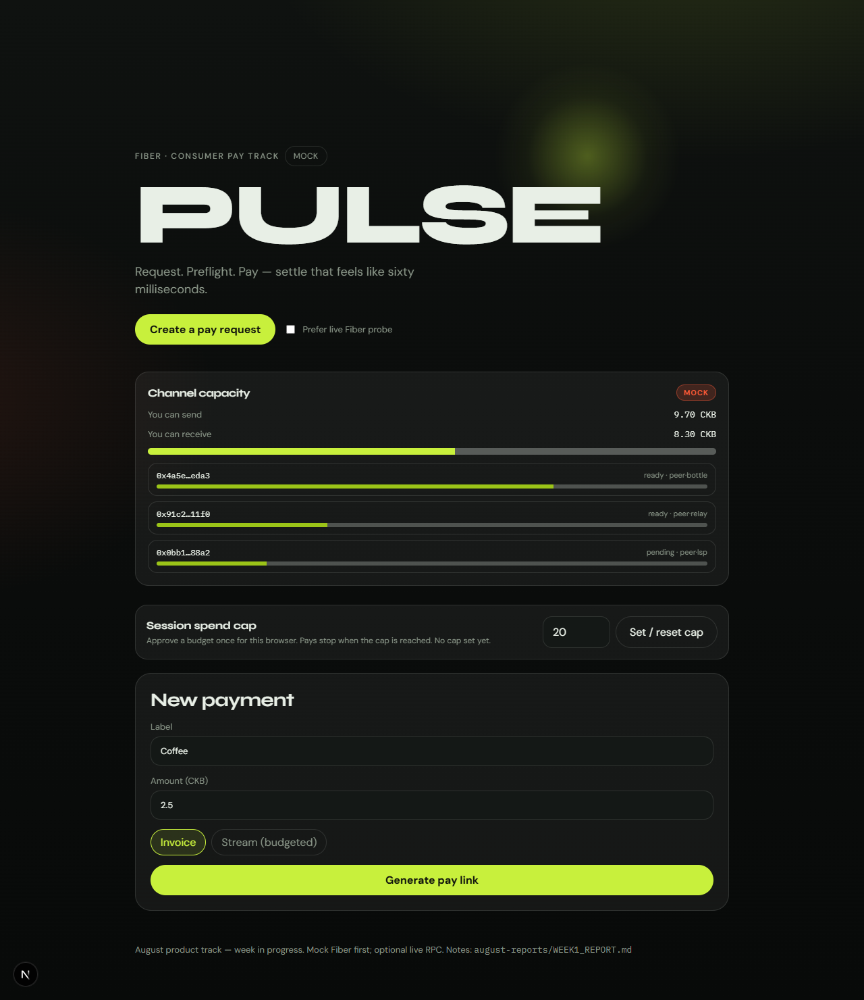
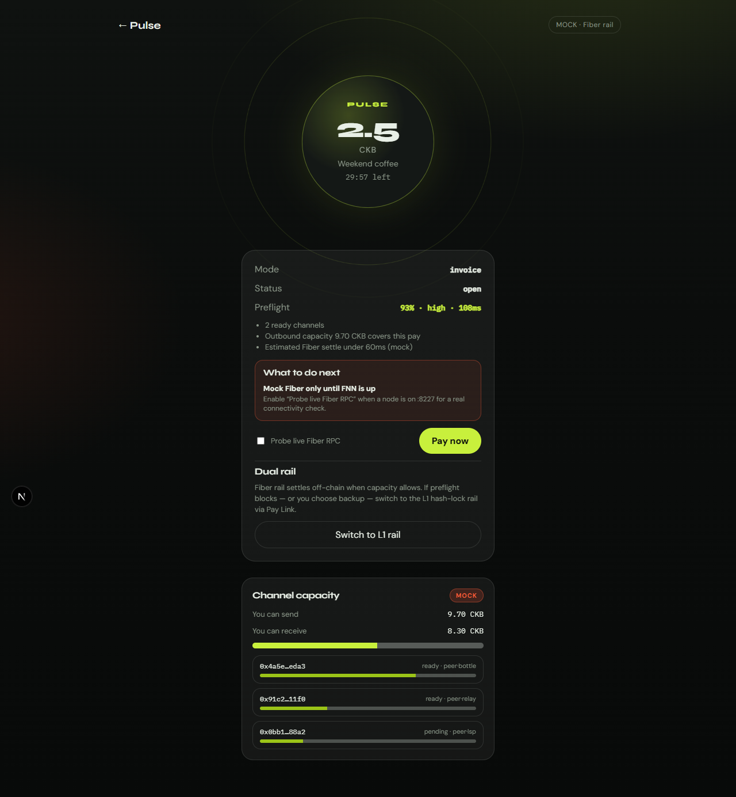
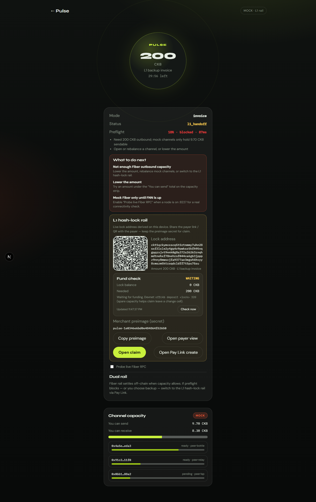

# August Week 1 Report — CKBuilders Learning Journey

## Overview

This report covers work from the week of **August 4, 2026**. After Pay Link’s Phase A Fiber probe, I shifted into Fiber Part 2 product work: a consumer pay flow where someone can create a request, share it, run preflight, settle when Fiber capacity allows, and fall back to L1 hash-lock when it does not.

The main deliverable is `fiber-pulse/`. Live Fiber invoice settle still depends on having the local FNN node up; the L1 dual-rail path is already proven on OffCKB.

---

## Context

July’s Fiber track was infrastructure-heavy. Part 2 is about **product**. I did not want another toolkit catalog. I wanted something a user can actually try: amount, share link, countdown, and either a fast settle or a clear L1 backup.

I kept private Part 1 research notes local and gitignored. They are not in this report or the app.

---

## Fiber Pulse

I built `fiber-pulse/` as a Next.js app on port **3060**.

### What I shipped

| Piece | Purpose |
|--------|---------|
| Create / share / QR / countdown | Self-contained `/?p=` pay links |
| MOCK / LIVE badge + capacity strip | Honest mock Fiber liquidity |
| Preflight + next-step fixes | Block or warn before pay |
| Session spend cap | Browser budget for demo spends |
| L1 rail | Derive hash-lock address from synced Pay Link deployment |
| Fund check | Poll lock balance; waiting / funded |
| Claim handoff | Open Pay Link claim with preimage, amount, address filled in |
| Pay Link query prefs | `view=create\|payer\|claim` + `from=pulse` |

Fiber settle in the UI is still mock-first (feels like ~60ms). Live Fiber RPC is optional when FNN is listening on `:8227`.

### L1 dual rail

Switching to L1 reuses the same hash-lock path as Pay Link:

1. Derive lock address from a merchant preimage.
2. Share address / payer link / QR.
3. Fund on OffCKB.
4. Claim in Pay Link with the preimage.

I sync deployment JSON from `ckb-pay-link` so Pulse and Pay Link stay on the same cell deps.

### Capacity lesson

This hash-lock runs through **ckb_js_vm**, so the lock args are large. On my current deploy, a cell needs roughly **108+ CKB** occupied. If a claim leaves change, the lock also needs spare capacity (~claim amount + ~110 CKB funded).

I raised Pay Link’s claim gate to **≥110 CKB** and added funding hints so a “100 CKB should work” demo does not fail for the wrong reason.

---

## Screenshots

### Pulse home — create a pay request



### Payer view — mock Fiber preflight on a small invoice



### L1 rail — Fiber capacity blocked, hash-lock backup with fund check



---

## What I verified

With OffCKB on `http://127.0.0.1:28114`:

| Check | Result |
|--------|--------|
| Pay Link `pnpm run preflight` | Pass (RPC + hash-lock cell dep live) |
| `pnpm run prove:l1-live` | Pass (tip, cell dep, address derive) |
| `pnpm run prove:l1-fund-claim` | Pass: deposit 320 CKB → funded → claim 200 CKB |
| Codec / handoff / typecheck | Pass |

Fund–claim proof tx: `0x79882b4a4ae10937d581ed9f2a23af03f63a8bc6e99e03d6540d88553b307f5c`.

I did not exercise LIVE Fiber settle this week. The FNN binary and node config are already on the machine; next is starting that node and wiring real invoice / payment calls.

---

## How to run

```powershell
# terminal 1
offckb node

# terminal 2
cd d:\CKB\Test\fiber-pulse
pnpm run sync:deployment
pnpm run run:all
pnpm run prove:l1-live
pnpm run prove:l1-fund-claim
pnpm run dev
```

1. Open http://127.0.0.1:3060  
2. Create a pay request (use ≥110 CKB for L1 tests)  
3. Open as payer, or force a Fiber capacity block, then **Switch to L1 rail**  
4. Confirm lock address + QR  
5. Fund: `offckb deposit <lock> 320` (example when claiming 200)  
6. Wait for **funded**, start Pay Link, **Open claim**  
7. Set receiver → Claim  

Stop apps with `Ctrl+C` when finished.

---

## Outcomes

1. Moved from Fiber-as-probe into a consumer-shaped pay product (`fiber-pulse`).
2. Kept Fiber mock-honest while making the L1 backup path live on OffCKB.
3. Proved the full L1 loop in script: deposit → fund check → claim.
4. Documented the real capacity floor for this hash-lock deploy.

---

## Next

1. Start the local Fiber node and replace mock settle with real invoice / payment where channels allow.  
2. Clearer LIVE Fiber errors when RPC is down.  
3. Optional: claim from Pulse without leaving for Pay Link.

---

## References

- [Run a Fiber Node](https://www.fiber.world/docs/quick-start/run-a-node)
- [Fiber basic transfer](https://docs.fiber.world/docs/quick-start/basic-transfer)
- Pay Link + simple-lock deployment in this repo (`ckb-pay-link/`, `simple-lock/`)
